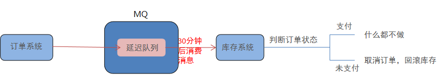

# RabbitMQ高级

## 课程目标

* RabbitMQ 高级特性
*  RabbitMQ 应用问题
* RabbitMQ 集群搭建

## 1、RabbitMQ高级特性

消息可靠性投递、Consumer ACK、消费端限流、TTL、死信队列、延迟队列、日志与监控、消息可靠性分析与追踪、管理

### 1.1 消息的可靠投递

在使用 RabbitMQ 的时候，作为消息发送方希望杜绝任何消息丢失或者投递失败场景。RabbitMQ 为我们提供了两种方式用来控制消息的投递可靠性模式。

* confirm 确认模式
* return  退回模式

rabbitmq 整个消息投递的路径为：

producer--->rabbitmq broker--->exchange--->queue--->consumer

* 消息从 producer 到 exchange，不管exchange是否收到生产者消息，都会返回一个 confirmCallback 。
* 消息从 exchange-->queue 投递失败则会返回一个 returnCallback 。

我们将利用这两个 callback 控制消息的可靠性投递

#### 1.1.1 confirmCallback 

1、创建maven工程，项目名rabbitmq-high-attr-producer，导入jar

~~~
    <dependencies>
        <dependency>
            <groupId>org.springframework</groupId>
            <artifactId>spring-context</artifactId>
            <version>5.2.10.RELEASE</version>
        </dependency>

        <dependency>
            <groupId>org.springframework.amqp</groupId>
            <artifactId>spring-rabbit</artifactId>
            <version>2.1.8.RELEASE</version>
        </dependency>

        <dependency>
            <groupId>junit</groupId>
            <artifactId>junit</artifactId>
            <version>4.12</version>
        </dependency>

        <dependency>
            <groupId>org.springframework</groupId>
            <artifactId>spring-test</artifactId>
            <version>5.2.10.RELEASE</version>
        </dependency>
    </dependencies>

    <build>
        <plugins>
            <plugin>
                <groupId>org.apache.maven.plugins</groupId>
                <artifactId>maven-compiler-plugin</artifactId>
                <version>3.8.0</version>
                <configuration>
                    <source>1.8</source>
                    <target>1.8</target>
                </configuration>
            </plugin>
        </plugins>
    </build>

</project>
~~~

2、创建属性文件 rabbitmq-high-attr-producer\src\main\resources\rabbitmq.properties

~~~
rabbitmq.host=192.168.128.129
rabbitmq.port=5672
rabbitmq.username=guest
rabbitmq.password=guest
rabbitmq.virtual-host=/
~~~

3、创建rabbitmq-high-attr-producer\src\main\resources\rabbitmq-producer配置文件

~~~
<?xml version="1.0" encoding="UTF-8"?>
<beans xmlns="http://www.springframework.org/schema/beans"
       xmlns:xsi="http://www.w3.org/2001/XMLSchema-instance"
       xmlns:context="http://www.springframework.org/schema/context"
       xmlns:rabbit="http://www.springframework.org/schema/rabbit"
       xsi:schemaLocation="http://www.springframework.org/schema/beans
       http://www.springframework.org/schema/beans/spring-beans.xsd
       http://www.springframework.org/schema/context
       https://www.springframework.org/schema/context/spring-context.xsd
       http://www.springframework.org/schema/rabbit
       http://www.springframework.org/schema/rabbit/spring-rabbit.xsd">

    <!--加载属性文件-->
    <context:property-placeholder location="rabbitmq.properties" />

    <!--定义rabbitmq connectionFactory-->
    <rabbit:connection-factory id="connectionFactory"
        host="${rabbitmq.host}" port="${rabbitmq.port}"
        username = "${rabbitmq.username}" password="${rabbitmq.password}"
        virtual-host="${rabbitmq.virtual-host}" publisher-confirms="true" />

    <!--定义管理交换机、队列-->
    <rabbit:admin connection-factory="connectionFactory"/>
    <!--定义rabbitTemplate对象操作 可以在代码中方便发送消息-->
    <rabbit:template id="rabbitTemplate" connection-factory="connectionFactory"/>

    <!--消息可靠性投递（生产端）-->
    <rabbit:queue id="test_queue_confirm" name = "test_queue_confirm"></rabbit:queue>
    <!--定义交换器，交互器和队列的绑定-->
    <rabbit:direct-exchange name="test_exchange_confirm">
        <rabbit:bindings>  <!--key 表示 路由键 -->
            <rabbit:binding queue="test_queue_confirm" key="confirm"></rabbit:binding>
        </rabbit:bindings>
    </rabbit:direct-exchange>
    
</beans>
~~~

4、编写测试类

~~~
package com.woniu.test;

import org.junit.Test;
import org.junit.runner.RunWith;
import org.springframework.amqp.rabbit.connection.CorrelationData;
import org.springframework.amqp.rabbit.core.RabbitTemplate;
import org.springframework.beans.factory.annotation.Autowired;
import org.springframework.test.context.ContextConfiguration;
import org.springframework.test.context.junit4.SpringJUnit4ClassRunner;
import org.springframework.test.context.junit4.SpringRunner;

@RunWith(SpringJUnit4ClassRunner.class)
@ContextConfiguration(locations = "classpath:spring-rabbitmq-producer.xml")
public class ProducerTest {

    @Autowired
    private RabbitTemplate rabbitTemplate;

    /** 步骤：
     * 确认模式： 生产者把消息发送给交换机，交换机收到消息的确认
     * 1、确认模式的开启：ConnectionFactory中开启 publisher-confirms="true"
     * 2、在rabbitTemplate定义confirmCallback回调函数
     */
    @Test
    public void testConfirm(){

        //定义回调
        rabbitTemplate.setConfirmCallback(new RabbitTemplate.ConfirmCallback() {
            /**
             *
             * @param correlationData  相关配置信息
             * @param ack 表示交换机是否成功收到生产者发送的 消息，true成功，false 失败
             * @param s 失败原因，如果成功则该参数值为“”
             */
            @Override
            public void confirm(CorrelationData correlationData, boolean ack, String s) {
                System.out.println("confirm方法被执行le.....");
                if(b){
                    System.out.println("接收成功消息" + s);
                }else{
                    //接收失败
                    System.out.println("接收失败消息" + s);
                    //做一些处理，让消息再次发送。
                }
            }
        });
        //该交换机test_exchange_confirm111不存在，故回调方法的ack为false
        rabbitTemplate.convertAndSend("test_exchange_confirm111","confirm","message confirm ...");
    }

}

//错误日志：reply-code=404, reply-text=NOT_FOUND - no exchange 'test_exchange_confirm111' in vhost '/',

~~~


#### 1.1.2 ReturnCallBack

在上个例子的基础上，再添加一个测试方法testReturn

~~~
 /**
     * 回退模式：当消息发送给Exchange，Exchange路由到Queue失败时，才执行ReturnCallback
     * 步骤
     * 1、开启回退模式：publisher-returns="true"
     * 2、设置ReturnCallBack
     * 3、设置Exchange处理消息的模式
     *    1、如果消息没有路由到queue，则丢弃消息（这是默认规则）
     *    2、如果消息没有路由到queue，返回给消息发送方ReturnCallBack
     * */
 	@Test
    public void testReturn(){

        //设置交换机处理消息的模式  默认丢弃消息 不处理
        rabbitTemplate.setMandatory(true);
        //设置 ReturnCallBack
        rabbitTemplate.setReturnCallback(new RabbitTemplate.ReturnCallback() {
            /**
             *
             * @param message 消息对象
             * @param replyCode 错误码
             * @param replyText 错误信息
             * @param exchange 交互及名称
             * @param routingKey 路由键
             */
            @Override
            public void returnedMessage(Message message, int replyCode, String replyText, String exchange, String routingKey) {
                System.out.println("return 执行了....");
                System.out.println(message);
                System.out.println(replyCode);
                System.out.println(replyText);
                System.out.println(exchange);
                System.out.println(routingKey);
                //处理
            }
        });
        rabbitTemplate.convertAndSend("test_exchange_confirm","confirm111","message confirm ...");
    }
    //由于路由键不正确 confirm111，故交换机的消息无法发送到消息队列，setReturnCallback（）方法，也就是Exchange路由到Queue失败时执行，这个前提是必须设置 rabbitTemplate.setMandatory(true);如果不加这句话，意味着交换机处理消息模式采用默认的模式，模式模式是直接丢掉该消息，不会执行setReturnCallback（）方法。  当然如果交换机发送消息到队列，如果成功了也不会执行该方法，因为setReturnCallback是交换机发送消息到队列失败才执行的。
~~~

消息的可靠投递小结

设置ConnectionFactory的publisher-confirms="true" 开启 确认模式。
使用rabbitTemplate.setConfirmCallback设置回调函数。当消息发送到exchange后回调confirm方法。在方法中判断ack，如果为true，则发送成功，如果为false，则发送失败，需要处理。

设置ConnectionFactory的publisher-returns="true" 开启 退回模式。使用rabbitTemplate.setReturnCallback设置退回函数，当消息从exchange路由到queue失败后，如果设置了rabbitTemplate.setMandatory(true)参数，则会将消息退回给producer。并执行回调函数returnedMessage。

在RabbitMQ中也提供了事务机制，但是性能较差，此处不做讲解。
使用channel下列方法，完成事务控制：
txSelect(), 用于将当前channel设置成transaction模式
txCommit()，用于提交事务
txRollback(),用于回滚事务

### 1.2 Consumer ACK

ack指Acknowledge，确认。 表示消费端收到消息后的确认方式。
有三种确认方式：

* 自动确认：acknowledge="none"
* 手动确认：acknowledge="manual"
* 根据异常情况确认：acknowledge="auto"，（这种方式使用麻烦，不作讲解）

其中自动确认是指，当消息一旦被Consumer接收到，则自动确认收到，并将相应 message 从 RabbitMQ 的消息缓存中移除。但是在实际业务处理中，很可能消息接收到，业务处理出现异常，那么该消息就会丢失。如果设置了手动确认方式，则需要在业务处理成功后，调用channel.basicAck()，手动确认，如果出现异常，则调用channel.basicNack()方法，让其自动重新发送消息。

1、在配置文件中 添加手动确认的配置

~~~
  <!--定义监听器容器-->
    <rabbit:listener-container connection-factory="connectionFactory" acknowledge="manual">
        <rabbit:listener ref="ackListener" queue-names="test_queue_confirm" />
    </rabbit:listener-container>
~~~

2、编写Ack监听器

~~~
package com.woniu.listener;

import com.rabbitmq.client.Channel;
import org.springframework.amqp.core.Message;
import org.springframework.amqp.rabbit.connection.ChannelListener;
import org.springframework.amqp.rabbit.listener.api.ChannelAwareMessageListener;
import org.springframework.stereotype.Component;

/**
 * Consumer ACK机制：
 * 1、设置手动签收，在 listener-container容器中 添加 acknowledge = ”manual“
 * 2. 让监听器类实现ChannelAwareMessageListener接口
 * 3、如果 消息成功处理，则调用channel的basicAck()签收
 * 4、如果消息处理失败，则调用channel的Nack()拒绝签收,broker会重新发送消息给 consumer
 */
@Component
public class AckListener implements ChannelAwareMessageListener {
    @Override
    public void onMessage(Message message, Channel channel) throws Exception {
        long deliveryTag = message.getMessageProperties().getDeliveryTag();
        try {
            //1、接受转换的消息
            System.out.println(new String(message.getBody()));
            //2、处理业务逻辑
            System.out.println("处理业务逻辑");

            //int m = 1/0;
            //3、手动签收
            channel.basicAck(deliveryTag,true);
        }catch(Exception ex){
            //4、拒绝签收
            /**  basicNack(long deliveryTag, boolean multiple, boolean requeue)
             *   deliveryTag 每次接收消息+1，可以理解为该消息的index
             *   multiple是否批量. true：将一次性拒绝所有小于deliveryTag的消息。
             *   requeue：被拒绝的消息是否重回队列。如果设置为true，则消息重新回到queue，broker会重新发送该消息给消费端
             */
            channel.basicNack(deliveryTag,true,true);
        }
    }
}

~~~

3、测试

~~~
@RunWith(SpringJUnit4ClassRunner.class)
@ContextConfiguration(locations = "classpath:spring-rabbitmq-consumer.xml")
public class ConsumerTest {

    @Test
    public void test(){
        while(true){

        }
    }
}
~~~

启动之前的生产者发送消息给test_queue_confirm队列，如果抛出异常则该消息一直重发

消息可靠性总结

持久化

* exchange要持久化
* queue要持久化
* message要持久化

生产方确认Confirm
消费方确认Ack
Broker高可用

### 1.3 消费端限流

消费端每次从队列中取一部分消息，然后消费者解决完业务处理，当业务处理完之后，消费者采用手动应答的方式，回应消息队列，然后继续取一部分消息处理，实现削峰填谷的效果，如下图：多个生产者同时给MQ发送消息10000万，如果不做消费端限流，那么A系统请求瞬间增多 。限流就是让A系统每次从MQ取1000条，然后做业务处理，当处理完后，手动应答队列，然后队列在发1000条处理，反复10次即可处理完请求。

 


注意点：在<rabbit:listener-container> 中配置 prefetch属性设置消费端一次拉取多少消息，消费端的确认模式一定为手动确认。acknowledge="manual"

1、在消费端工程的配置文件配置如下

~~~
<!--定义监听器容器-->
    <!--acknowledge="manual" 表示手动应答，prefetch  = 1 表示每次从队列取1条，当然也可以prefetch = 10
    每次取10条-->
    <rabbit:listener-container connection-factory="connectionFactory"
                               acknowledge="manual" prefetch = "1">
        <!--<rabbit:listener ref="ackListener" queue-names="test_queue_confirm" />-->
        <rabbit:listener ref="qosListener" queue-names="test_queue_confirm" />
    </rabbit:listener-container>
~~~

2、编写监听器

~~~
package com.woniu.listener;

import com.rabbitmq.client.Channel;
import org.springframework.amqp.core.Message;
import org.springframework.amqp.rabbit.listener.api.ChannelAwareMessageListener;
import org.springframework.stereotype.Component;

/**
 * Consumer 限流机制
 * 1、阙波啊ack机制为手动确认
 * 2、listener-container配置属性
 *    prefetch = 1 表示消费端每次从mq拉去一条消息来消费，直到手动确认消费完毕后，才会继续拉去下一条消息。
 */
@Component
public class QosListener implements ChannelAwareMessageListener {
    @Override
    public void onMessage(Message message, Channel channel) throws Exception {
        Thread.sleep(1000);
        //1、获取消息
        System.out.println(new String(message.getBody()));
        //2、处理业务逻辑
        //3、签收
        channel.basicAck(message.getMessageProperties().getDeliveryTag(),true);
    }
}

~~~

3、启动消费端工程

 4、在生产者方，添加一个测试方法，给test_queue_confirm队列发送消息

~~~
 //限流测试
    @Test
    public void testSendQos(){

        for (int i = 0; i <10 ; i++) {
            rabbitTemplate.convertAndSend("test_exchange_confirm","confirm","message confirm ...");
        }
    }
~~~

注意：每次从队列中取一条处理，然后手动应答，如果注释掉手动应答（签收），那么消费者在第一次取一条消息后，不会从队列取消息了，因为这个时候队列的状态是Unacked（表示有一条为签收），ready为9，表示队列还有9条消息

### 1.4 TTL

TTL 全称 Time To Live（存活时间/过期时间）。当消息到达存活时间后，还没有被消费，会被自动清除。RabbitMQ可以对消息设置过期时间，也可以对整个队列（Queue）设置过期时间。当消息超过过期时间还没有被消费，则丢弃

 

方式1：在图形界面添加交换机和添加队列去实现

添加交换机

 

添加队列，设置队列的过期时间

 

交换机和消息队列的绑定

 

交换机发送消息  

 


代码实现：由于ttl表示消息在队列的存活时间，所以在生产者工程操作

1、配置文件

```
<!--ttl配置-->
<rabbit:queue id="test_queue_ttl" name="test_queue_ttl">
    <!--设置 queue的参数-->
    <rabbit:queue-arguments>
        <!--队列的消息 存活时间为10秒-->
        <entry key="x-message-ttl" value="10000" value-type="java.lang.Integer"></entry>
    </rabbit:queue-arguments>
</rabbit:queue>
<rabbit:topic-exchange name="test_exchange_ttl">
    <rabbit:bindings>
        <rabbit:binding pattern="ttl.#" queue="test_queue_ttl"></rabbit:binding>
    </rabbit:bindings>
</rabbit:topic-exchange>
```

2、测试

```
//ttl测试
@Test
public void testTtl(){

    //1、会对整个队列消息统一过期：给test_exchange_ttl 发送10条消息，交换机发给 test_queue_ttl 10秒后，10条消息消失
   /* for (int i = 0; i <10 ; i++) {
        //发送消息
        rabbitTemplate.convertAndSend("test_exchange_ttl","ttl.haha","message ttl");
    }*/

    //2、某条消息单独设置过期时间
    // MessagePostProcessor 用来设置消息信息的
    MessagePostProcessor messagePostProcessor = new MessagePostProcessor() {
        @Override
        public Message postProcessMessage(Message message) throws AmqpException {
            //刚才我们在配置文件设置的队列的消息是10秒，这里是5秒，注意:以时间短的为准
            message.getMessageProperties().setExpiration("5000"); //消息的过期时间
            return message;//消息一定要返回
        }
    };
   /* rabbitTemplate.convertAndSend("test_exchange_ttl","ttl.haha",
            "message haha",messagePostProcessor);*/

    //3、发送给队列的n条信息中  单独给某个消息设置过期
    for (int i = 0; i < 10; i++) {
        if(i==5){
            //当i == 5 时，也就是给第五条消息设置过期时间是5秒，其它的还是10秒，那么注意：当该消息在队列头部时（消费时），
            // 会单独判断这一消息是否过期。由于这条发送给队列的时候不是在队列的头部，故不会单独判断，而是和其它队列一样，10秒钟就消失
            rabbitTemplate.convertAndSend("test_exchange_ttl","ttl.haha",
                    "message haha",messagePostProcessor);
        }else{
            rabbitTemplate.convertAndSend("test_exchange_ttl","ttl.haha",
                    "message haha");
        }
    }
}
```

总结：

1、设置队列过期时间使用参数：x-message-ttl，单位：ms(毫秒)，会对整个队列消息统一过期。测试1

2、如果两者都进行了设置，以时间短的为准。

3、设置消息过期时间使用参数：expiration。单位：ms(毫秒)，当该消息在队列头部时（消费时），会单独判断这一消息是否过期。

以上测试代码证明3点


### 1.5 死信队列

死信队列，英文缩写：DLX  。Dead Letter Exchange（死信交换机），当消息在队列成为Dead message后，通过该队列把这条死信消息发给另一个交换机，这个交换机就是DLX。

 

消息成为死信的三种情况（面试常问）：

* 队列消息长度到达限制；
* 消费者拒接消费消息，basicNack/basicReject,并且不把消息重新放入原目标队列,requeue=false；
* 原队列存在消息过期设置，消息到达超时时间未被消费；

队列绑定死信交换机：
     给队列设置参数： x-dead-letter-exchange 和 x-dead-letter-routing-key

 

实现过程：

1、配置交换机和队列

```
<!--
 DLX 死信队列 步骤
    1、声明正常的队列(test_queue_dlx) 和正常的交换机(text_exchange_dlx)
    2、声明死信队列（queue_dlx）和死信交换机（exchange_dlx）
    3、正常队列绑定死信交换机
        设置两个参数
            x-dead-letter-exchange：死信交换机的名称
            x-dead-letter-routing-key：发送给死信交换机的routingkey
 -->
<!--1、声明正常队列（test_queue_dlx）和交换机（test_exchange_dlx）-->
<rabbit:queue name="test_queue_dlx" id="test_queue_dlx">
    <!--3、正常队列绑定死信交换机-->
    <rabbit:queue-arguments>
        <!--3.1 x-dead-letter-exchange 死信交换机的名称-->
        <entry key="x-dead-letter-exchange" value="exchange_dlx" />
        <!--3.2 x-dead-letter-routing-key 正常队列发送消息到死信 交换机的routingKey-->
        <!--注意：这个routingKey和死信交换机发送消息到死信队列 匹配一致-->
        <!--dlx.# 能匹配到 dlx.hehe（dlx.xx都可以） -->
        <entry key="x-dead-letter-routing-key" value="dlx.hehe" />
        <!--4 消息成为死信的三种情况 -->
        <!-- 4.1 设置队列的过期时间 ttl  x-message-ttl -->
        <entry key="x-message-ttl" value="10000" value-type="java.lang.Integer" />
         <!--4.2 设置队列的长度限制 x-max-length-->
        <entry key="x-max-length" value-type="java.lang.Integer" value="10" />
        <!--4.3 消费者拒接消费消息，并且不重回队列 这种情况后面在消费工程测试-->
    </rabbit:queue-arguments>
</rabbit:queue>
<rabbit:topic-exchange name="test_exchange_dlx">
    <rabbit:bindings>
        <!--正常交换机发给正常队列的routingkey-->
        <rabbit:binding pattern="test.dlx.#" queue="test_queue_dlx"></rabbit:binding>
    </rabbit:bindings>
</rabbit:topic-exchange>
<!--2、声明死信队列（queue_dlx）和死信交换机(exchange_dlx)-->
<rabbit:queue name="queue_dlx"></rabbit:queue>
<rabbit:topic-exchange name="exchange_dlx">
    <rabbit:bindings>
        <!--pattern 死信交换机发送给死信队列的 routingkey-->
        <rabbit:binding pattern="dlx.#" queue="queue_dlx"></rabbit:binding>
    </rabbit:bindings>
</rabbit:topic-exchange>
```

2、生产者工程测试：

```
//死信队列测试
@Test
public void testDlx(){
    //1、测试过期时间，死信消息
    //rabbitTemplate.convertAndSend("test_exchange_dlx","test.dlx.haha","我是一条消息，我会死吗");

    //2、测试队列长度限制，消息死信
   /* for (int i = 0; i < 20 ; i++) {
        rabbitTemplate.convertAndSend("test_exchange_dlx","test.dlx.haha","我是一条消息，我会死吗");
    }*/
    //前两步测试结果：死信队列会有21条记录  1（过期） + 10（限制）+10（正常队列过期后的10条）
 
}
```

消息成为死信的第三种情况

1、打开消费端工程

```
<!--定义监听器容器-->
<!--acknowledge="manual" 表示手动应答，prefetch  = 1 表示每次从队列取1条，当然也可以prefetch = 10
每次取10条-->
<rabbit:listener-container connection-factory="connectionFactory"
                           acknowledge="manual" prefetch = "1">
    <!--<rabbit:listener ref="ackListener" queue-names="test_queue_confirm" />-->
    <!--<rabbit:listener ref="qosListener" queue-names="test_queue_confirm" />-->
    <rabbit:listener ref="dlxListener" queue-names="test_queue_dlx" />
</rabbit:listener-container>
```

2、添加正常队列的监听器

```
package com.woniu.listener;

import com.rabbitmq.client.Channel;
import org.springframework.amqp.core.Message;
import org.springframework.amqp.rabbit.listener.api.ChannelAwareMessageListener;
import org.springframework.stereotype.Component;


@Component
public class DlxListener implements ChannelAwareMessageListener {
    @Override
    public void onMessage(Message message, Channel channel) throws Exception {
        long deliveryTag = message.getMessageProperties().getDeliveryTag();
        try {
            //1、接受转换的消息
            System.out.println(new String(message.getBody()));
            //2、处理业务逻辑
            System.out.println("处理业务逻辑");
            int m = 1/0;
            //3、手动签收
            channel.basicAck(deliveryTag,true);
        }catch(Exception ex){
            //4、拒绝签收
            /**  basicNack(long deliveryTag, boolean multiple, boolean requeue)
             *   deliveryTag 每次接收消息+1，可以理解为该消息的index
             *   multiple是否批量. true：将一次性拒绝所有小于deliveryTag的消息。
             *   requeue：被拒绝的消息是否重回队列。如果设置为true，则消息重新回到queue，broker会重新发送该消息给消费端
             */
            //4.拒绝签收，不重回队列 requeue=false
            channel.basicNack(deliveryTag,true,false);
        }
    }
}
```

注意：basicNack  第三个参数设置成false

3、测试:启动消费端的监听

4、在生产端的testDlx方法添加  再次给正常交换机发送消息

```
//死信队列测试
@Test
public void testDlx(){
    //1、测试过期时间，死信消息
    //rabbitTemplate.convertAndSend("test_exchange_dlx","test.dlx.haha","我是一条消息，我会死吗");

    //2、测试队列长度限制，消息死信
   /* for (int i = 0; i < 20 ; i++) {
        rabbitTemplate.convertAndSend("test_exchange_dlx","test.dlx.haha","我是一条消息，我会死吗");
    }*/
    //前两步测试结果：死信队列会有21条记录  1（过期） + 10（限制）+10（正常队列过期后的10条）

    //3. 测试消费者消息拒收
    rabbitTemplate.convertAndSend("test_exchange_dlx","test.dlx.haha","我是一条消息，我会死吗？");
}
```

总结：

1. 死信交换机和死信队列和普通的没有区别
2. 当消息成为死信后，如果该队列绑定了死信交换机，则消息会被死信交换机重新路由到死信队列
3. 消息成为死信的三种情况：
   * 队列消息长度到达限制；
   * 消费者拒接消费消息，并且不重回队列；
   * 原队列存在消息过期设置，消息到达超时时间未被消费


### 1.6 延迟队列

延迟队列，即消息进入队列后不会立即被消费者调用，只有到达指定时间后，才会被调用者调用消费。

需求：

1、下单后，30分钟未支付，取消订单，回滚库存。

 

当用户提交订单后，消息队列保存订单的信息（如订单Id），此时库存系统监听队列，队列不会把消息立刻发送给库存，而是过30分钟再把信息发送给库存系统，库存系统去查询订单数据库，根据订单id查询，如果该订单还没有支付，则取消订单，回滚库存，如果支付过了，则库存表什么都不用做。也就是给用户30分钟的机会，一个订单在30分钟后还没有支付，则该订单的库存信息直接回滚。

2、新用户注册成功7天后，发送短信问候。

实现方式：
1. 定时器：我们可以写一段代码，在某个时间段查询订单表的支付情况。把提交订单的时间查出来和当前系统时间比较，30分钟之类如果订单状态为支付，则取消该订单，大家思考一下有什么问题？
2. 延迟队列

很可惜，在RabbitMQ中并未提供延迟队列功能。但是可以使用：TTL+死信队列 组合实现延迟队列的效果。

 

实现过程：

1、延迟队列配置文件创建

~~~
 <!--延迟队列
        1、定义正常交换机（order_exchange）和队列（order_queue）
        2、定义死信交换机（order_exchange_dlx）和队列（order_queue_dlx）
        3、绑定，设置正常队列过期时间为30分钟
     -->
    <!--1、定义正常交换机（order_exchange）和队列（order_queue）-->
    <rabbit:queue name="order_queue" id="order_queue">
        <rabbit:queue-arguments>
            <!--3、绑定，设置正常队列过期时间为30分钟。这里我们时间设置10秒 为了测试-->
            <entry key="x-dead-letter-exchange" value="order_exchange_dlx" />
            <entry key="x-dead-letter-routing-key" value="dlx.order.cancel" />
            <entry key="x-message-ttl" value="10000" value-type="java.lang.Integer" />
        </rabbit:queue-arguments>
    </rabbit:queue>
    <rabbit:topic-exchange name="order_exchange">
        <rabbit:bindings>
            <rabbit:binding pattern="order.#" queue="order_queue"></rabbit:binding>
        </rabbit:bindings>
    </rabbit:topic-exchange>
    <!--2、定义死信交换机（order_exchange_dlx）和队列（order_queue_dlx）-->
    <rabbit:queue id="order_queue_dlx" name="order_queue_dlx"></rabbit:queue>
    <rabbit:topic-exchange name="order_exchange_dlx">
        <rabbit:bindings>
            <rabbit:binding pattern="dlx.order.#" queue="order_queue_dlx"></rabbit:binding>
        </rabbit:bindings>
    </rabbit:topic-exchange>
~~~

2、消费者监听死信队列配置

~~~
 <!--定义监听器容器-->
    <!--acknowledge="manual" 表示手动应答，prefetch  = 1 表示每次从队列取1条，当然也可以prefetch = 10
    每次取10条-->
    <rabbit:listener-container connection-factory="connectionFactory"
                               acknowledge="manual" prefetch = "1">
        <!--<rabbit:listener ref="ackListener" queue-names="test_queue_confirm" />-->
        <!--<rabbit:listener ref="qosListener" queue-names="test_queue_confirm" />-->
       <!-- <rabbit:listener ref="dlxListener" queue-names="test_queue_dlx" />-->

        <!--注意这个地方 是监听死信队列的 -->
        <rabbit:listener ref="orderListener" queue-names="order_queue_dlx" />
    </rabbit:listener-container>
~~~

3、监听类

```
package com.woniu.listener;

import com.rabbitmq.client.Channel;
import org.springframework.amqp.core.Message;
import org.springframework.amqp.rabbit.listener.api.ChannelAwareMessageListener;
import org.springframework.stereotype.Component;


@Component
public class OrderListener implements ChannelAwareMessageListener {
    @Override
    public void onMessage(Message message, Channel channel) throws Exception {
        long deliveryTag = message.getMessageProperties().getDeliveryTag();

        try {
            //1.接收转换消息
            System.out.println(new String(message.getBody()));

            //2. 处理业务逻辑
            System.out.println("处理业务逻辑...");
            System.out.println("根据订单id查询其状态...");
            System.out.println("判断状态是否为支付成功");
            System.out.println("取消订单，回滚库存....");
            //3. 手动签收
            channel.basicAck(deliveryTag,true);
        } catch (Exception e) {
            //e.printStackTrace();
            System.out.println("出现异常，拒绝接受");
            //4.拒绝签收，不重回队列 requeue=false
            channel.basicNack(deliveryTag,true,false);
        }
    }
}
```

4、生产者测试类方法：

```
//延迟队列测试
@Test
public void testDelay() throws InterruptedException {
    //1.发送订单消息。 将来是在订单系统中，下单成功后，发送消息
    rabbitTemplate.convertAndSend("order_exchange","order",
            "订单信息：id=1,time=2021年1月1日16:41:47");

    //2.打印倒计时10秒  10秒后 消息发送到死信队列，而监听器OrderListener是监听死信队列的
    for (int i = 10; i > 0 ; i--) {
        System.out.println(i+"...");
        Thread.sleep(1000);
    }
}
```

5、启动消费者测试程序


### 1.7 日志与监控

#### 1.7.1 RabbitMQ日志

RabbitMQ默认日志存放路径： /var/log/rabbitmq/rabbit@xxx.log

日志包含了RabbitMQ的版本号、Erlang的版本号、RabbitMQ服务节点名称、cookie的hash值、RabbitMQ配置文件地址、内存限制、磁盘限制、默认账户guest的创建以及权限配置等等。

#### 1.7.2 web管控台监控

~~~
查看队列
# rabbitmqctl list_queues

查看exchanges
# rabbitmqctl list_exchanges

查看用户
# rabbitmqctl list_users

查看连接
# rabbitmqctl list_connections

查看消费者信息
# rabbitmqctl list_consumers

查看环境变量
# rabbitmqctl environment

查看未被确认的队列
# rabbitmqctl list_queues  name messages_unacknowledged

查看单个队列的内存使用
# rabbitmqctl list_queues name memory

查看准备就绪的队列
# rabbitmqctl list_queues name messages_ready

~~~


### 1.8 消息追踪

在使用任何消息中间件的过程中，难免会出现某条消息异常丢失的情况。对于RabbitMQ而言，可能是因为生产者或消费者与RabbitMQ断开了连接，而它们与RabbitMQ又采用了不同的确认机制；也有可能是因为交换器与队列之间不同的转发策略；甚至是交换器并没有与任何队列进行绑定，生产者又不感知或者没有采取相应的措施；另外RabbitMQ本身的集群策略也可能导致消息的丢失。这个时候就需要有一个较好的机制跟踪记录消息的投递过程，以此协助开发和运维人员进行问题的定位。

在RabbitMQ中可以使用Firehose和rabbitmq_tracing插件功能来实现消息追踪。

#### 1.8.1 消息追踪-Firehose

firehose的机制是将生产者投递给rabbitmq的消息，rabbitmq投递给消费者的消息按照指定的格式发送到默认的exchange上。这个默认的exchange的名称为amq.rabbitmq.trace，它是一个topic类型的exchange。发送到这个exchange上的消息的routing key为 publish.exchangename 和 deliver.queuename。其中exchangename和queuename为实际exchange和queue的名称，分别对应生产者投递到exchange的消息，和消费者从queue上获取的消息。

注意：打开 trace 会影响消息写入功能，适当打开后请关闭。

~~~
rabbitmqctl trace_on：开启Firehose命令
rabbitmqctl trace_off：关闭Firehose命令
~~~

1、会多一个交换机

 

2、新建一个消息队列 并给该交换机绑定一个消息队列

 

 

3、打开test_trace队列，并往队列发送一条消息

 

4、查看消息，如显示10条，发现队列有很多消息，除了队列自己给自己发消息外，qma.rabbit.trace交换机也发日志消息给该队列

 

#### 1.8.2 消息追踪-rabbitmq_tracing

rabbitmq_tracing和Firehose在实现上如出一辙，只不过rabbitmq_tracing的方式比Firehose多了一层GUI的包装，更容易使用和管理。
启用插件：

~~~
[root@localhost ~]# rabbitmq-plugins enable rabbitmq_tracing
~~~


1、新建一个trace，将来所有的消息都被trace保存起来

 

#.publish是把所有的生产者发送的消息保存到日志文件，这里用# 表示接受所有的日志消息

 

不管在哪个队列发送消息 都会保存到日志文件mytrace.log中

## 2、RabbitMQ应用问题

消息可靠性保障、消息幂等性处理

### 2.1 消息可靠性保障-消息补偿

* 消息补偿机制

需求：
	100%确保消息发送成功

 

 

### 2.2 消息幂等性保障-乐观锁

幂等性指一次和多次请求某一个资源，对于资源本身应该具有同样的结果。也就是说，其任意多次执行对资源本身所产生的影响均与一次执行的影响相同。MQ中指，消费多条相同的消息，得到与消费该消息一次相同的结果。

* 乐观锁解决方案

  

第一次生产者发送一条消息，但是消费方系统宕机，即不能立即消费，于是回调检查服务监听不到Q2的响应消息，也不会写入数据库MDB，当隔一段时间后，生产者又发送一条延迟消息到Q3队列，回调检查服务能监听到Q3队列消息，于是和MDB去比较是否有，由于消费方的失败，消息最终没有入库MDB，这个时候回调检查服务和MDB数据库比对失败，于是通知生产者，重新发送一条消息给消费者，那么这个时候Q1就有2条消息了，当消费方正常运行的时候，由于监听的Q1是两条2消息，怎么办呢？乐观锁

第一次执行：version=1
update account set money = money - 500 , version = version + 1
where id = 1 and version = 1

第二次执行：version=2
update account set money = money - 500 , version = version + 1
where id = 1 and version = 1


## 3、RabbitMQ集群搭建

RabbitMQ高可用集群